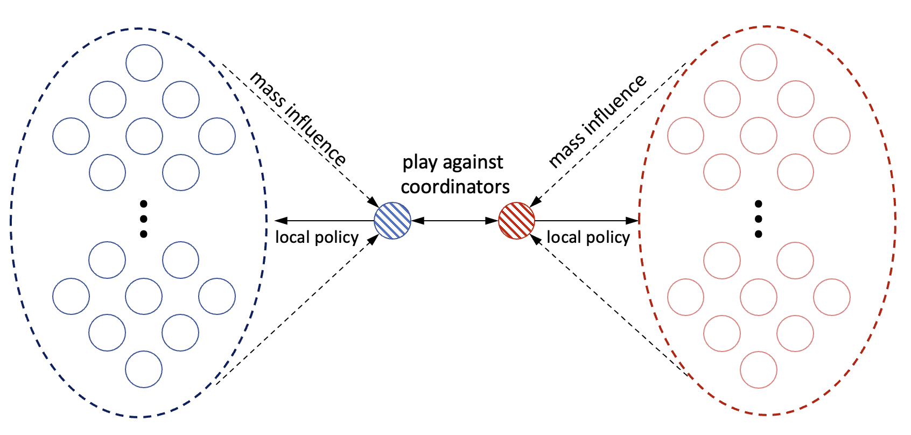

# Zero-Sum Mean-Field Team Games

This is the code for the numerical examples presented in the paper 
[Zero-Sum Games between Mean-Field Teams: A Commen Information and Reachability based Analysis](https://arxiv.org/abs/2303.12243).

## Installation
- To install, `cd` into the root directory and type `pip install -r requirements.txt`
- Known dependencies: Python (3.8), Numpy (1.24.2), Scipy (1.10.1), Matplotlib (3.7.1).

## Numerical Examples 1
- Game environment is located in `simple_example/examples` as the class `SimpleExample1`.
- To solve and plot the value functions, run `simple_example_1.py`
- Options available
  - `SOLVE_COR`: solve the coordinator game via discretization if set true, else load from pkl file
  - `PLOT_VALUE`: plot the value functions if true
  - `PLOT_RSet`: visualize the reachable set if set true

## Numerical Examples 2
- Game environment is located in `simple_example/examples` as the class `SimpleExample2`.
- To solve and plot the value functions, run `simple_example_2.py`
- Options available
  - `SOLVE_COR`: solve the coordinator game via discretization if set true, else load from pkl file
  - `PLOT_VALUE`: plot the value functions if true
  - `PLOT_RSet`: visualize the reachable set if set true
  - `SOLVE_DEVIATE`: solve the optimal performance in finite-population case if true
  - `PLOT_DEVIATE`: plot the trend of performance gained from deviation vs. number of agents